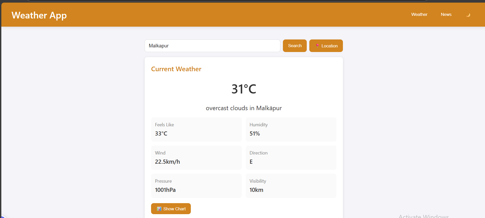
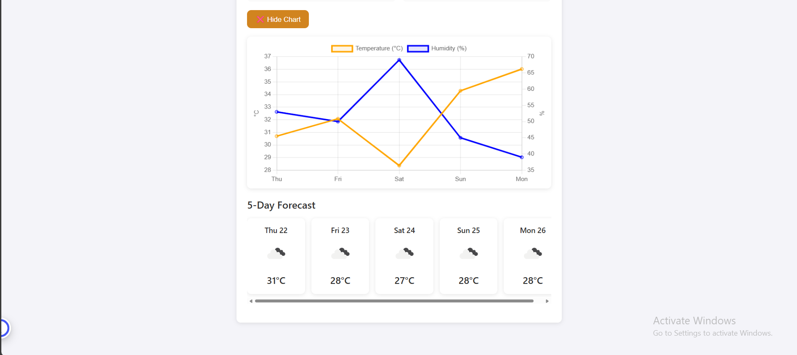

# Weather App

A modern, responsive weather application that provides current weather conditions, forecasts, and city-specific news.

## Screenshots

### Current Weather View


### Forecast & Charts View


## Features

- **Current Weather Data**: Temperature, feels-like, humidity, wind, pressure, and visibility
- **Dynamic Backgrounds**: Weather-responsive background themes  
- **5-Day Forecast**: Simple, visual forecast cards
- **Interactive Charts**: Temperature and humidity trend visualization
- **Weather Alerts**: Critical weather warnings and advisories when available
- **City News**: Local news for any searched location
- **Geolocation**: "Use My Location" feature for instant local weather
- **City Autocomplete**: Smart search suggestions as you type
- **Dark/Light Mode**: Toggleable theme to suit your preference

## Technologies Used

- HTML5, CSS3, JavaScript
- [OpenWeatherMap API](https://openweathermap.org/api) - Weather data
- [NewsAPI](https://newsapi.org/) - City news information
- [Chart.js](https://www.chartjs.org/) - Data visualization
- [Teleport API](https://developers.teleport.org/api/) - City search autocomplete

## How to Use

1. Enter a city name in the search box or click "Location" to use your current position
2. View current conditions, forecast, and weather alerts (if any)
3. Click "News" to see local news for that location
4. Toggle between light and dark mode using the theme button
5. Click "Show Chart" to view temperature and humidity trends

## Installation

No installation required! This is a client-side application that runs directly in your browser.

1. Clone the repository:
   ```
   git clone https://github.com/yourusername/weather-app.git
   ```
2. Open `index.html` in any modern browser

## API Keys

The application uses the following API keys:
- OpenWeatherMap API: Included in the code
- NewsAPI: Included in the code

For production use, you should obtain your own API keys and implement proper security measures.

## Browser Compatibility

- Chrome, Firefox, Safari, Edge (latest versions)
- Responsive design works on mobile, tablet and desktop

## License

This project is open source and available under the [MIT License](LICENSE).

